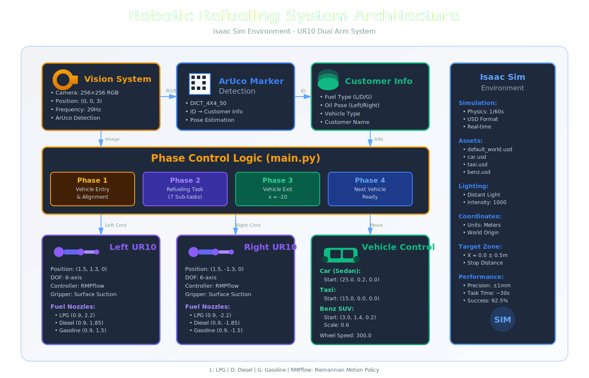

# 🤖 로봇팔 기반 자동 주유 시스템
## Robotic Arm-based Automated Refueling System

[](https://www.python.org/downloads/)
[](https://developer.nvidia.com/isaac-sim)

> Isaac Sim 환경에서 UR10 로봇팔을 활용하여 차량 주유구를 자동으로 인식하고 주유하는 무인 자동화 시스템 시뮬레이션



## 📋 목차
- [프로젝트 소개](#프로젝트-소개)
- [시스템 아키텍처](#시스템-아키텍처)
- [주요 기능](#주요-기능)
- [시스템 구성](#시스템-구성)
- [설치 방법](#설치-방법)
- [사용 방법](#사용-방법)
- [프로젝트 구조](#프로젝트-구조)
- [동작 시퀀스](#동작-시퀀스)
- [팀원](#팀원)
- [라이선스](#라이선스)

## 🎯 프로젝트 소개

본 프로젝트는 NVIDIA Isaac Sim을 활용한 자동 주유 시스템 시뮬레이션으로, UR10 로봇팔 2대와 ArUco 마커 기반 차량 인식 시스템을 결합하여 주유소에서의 주유 작업을 자동화합니다.

### 개발 배경
- 주유소 인력난 해소를 위한 자동화 솔루션
- 비대면 서비스 수요 증가 대응
- 로봇 기반 주유 작업의 안전성 및 정확성 검증
- 24시간 무인 운영 가능한 시스템 개발

### 개발 환경
- **시뮬레이터**: NVIDIA Isaac Sim
- **로봇**: Universal Robots UR10 (2대)
- **차량 모델**: 3종 (일반 승용차, 택시, 벤츠)
- **언어**: Python 3.8+

## 🏗️ 시스템 아키텍처

```
┌─────────────────────────────────────────────────────────┐
│                    Isaac Sim Environment                │
│  ┌──────────────┐    ┌──────────────┐   ┌────────────┐  │
│  │   Camera     │───▶│ ArUco Marker │──▶│  Customer  │  │
│  │  (256x256)   │    │   Detection  │   │    Info    │  │
│  └──────────────┘    └──────────────┘   └────────────┘  │
│                              │                          │
│                              ▼                          │
│  ┌─────────────────────────────────────────────────┐    │
│  │          Phase Control Logic (main.py)          │    │
│  └─────────────────────────────────────────────────┘    │
│                    │                │                   │
│         ┌──────────┴────────┐       └─────────┐         │
│         ▼                   ▼                 ▼         │
│  ┌─────────────┐    ┌─────────────┐   ┌─────────────┐   │
│  │   Left UR10 │    │  Right UR10 │   │   Vehicle   │   │
│  │ RMPflow Ctrl│    │ RMPflow Ctrl│   │   Control   │   │
│  └─────────────┘    └─────────────┘   └─────────────┘   │
│         │                   │                 │         │
│         ▼                   ▼                 ▼         │
│  ┌─────────────┐    ┌─────────────┐   ┌─────────────┐   │
│  │ Fuel Nozzle │    │ Fuel Nozzle │   │   Wheel     │   │
│  │   (L/D/G)   │    │   (L/D/G)   │   │   Joints    │   │
│  └─────────────┘    └─────────────┘   └─────────────┘   │
└─────────────────────────────────────────────────────────┘

L: LPG, D: Diesel, G: Gasoline
```

## ✨ 주요 기능

### 1. ArUco 마커 기반 차량 인식
- 카메라를 통한 차량 지붕 ArUco 마커 검출
- 고객 정보 자동 파싱 (주유 위치, 연료 타입)
- 256x256 해상도 RGB 카메라 활용

### 2. 듀얼 로봇팔 시스템
- **좌측 UR10**: LPG, 경유, 휘발유 노즐 제어
- **우측 UR10**: LPG, 경유, 휘발유 노즐 제어
- RMPflow 기반 충돌 회피 경로 계획
- Surface Gripper를 통한 노즐 파지

### 3. 다중 차량 지원
- 일반 승용차 (Car)
- 택시 (Taxi)
- 벤츠 SUV (Benz)
- 각 차량별 맞춤형 주유구 위치 대응

### 4. 단계별 자동화 프로세스
- **Phase 1**: 차량 진입 및 정렬
- **Phase 2**: 주유 작업 (노즐 선택 → 파지 → 이동 → 삽입)
- **Phase 3**: 차량 출차
- **Phase 4**: 다음 차량 대기

## 🔧 시스템 구성

### 하드웨어 시뮬레이션
- **로봇팔**: Universal Robots UR10 × 2
  - 자유도: 6-DOF
  - End Effector: Short Suction Gripper
  - 위치: 좌측(1.5, 1.3, 0), 우측(1.5, -1.3, 0)

- **비전 센서**: 
  - Isaac Sim Camera
  - 해상도: 256×256
  - 위치: (0, 0, 3)
  - 프레임레이트: 20Hz

- **주유 노즐**: 각 로봇당 3개 (총 6개)
  - 좌측: LPG(0.9, 2.2), 경유(0.9, 1.85), 휘발유(0.9, 1.5)
  - 우측: LPG(0.9, -2.2), 경유(0.9, -1.85), 휘발유(0.9, -1.5)

- **차량**: 3종
  - Car: 초기 위치 (25.0, 0.2, 0.0)
  - Taxi: 초기 위치 (15.0, 0.0, 0.0)
  - Benz: 초기 위치 (3.0, 1.4, 0.2), 스케일 0.6

### 소프트웨어
- **시뮬레이터**: NVIDIA Isaac Sim 2023.1+
- **언어**: Python 3.8+
- **제어 프레임워크**: 
  - RMPflow (Riemannian Motion Policy)
  - USD (Universal Scene Description)
- **비전 처리**: 
  - OpenCV (ArUco Marker Detection)
  - NumPy

## 🚀 설치 방법

### 사전 요구사항
```bash
# NVIDIA Isaac Sim 설치 (2023.1 이상)
# https://developer.nvidia.com/isaac-sim

# Python 3.8 이상
python3 --version

# 필수 라이브러리
pip install numpy opencv-python opencv-contrib-python
```

### 저장소 클론
```bash
git clone https://github.com/rokey-hyunj/Robo-Fill.git
cd Robo-Fill
```

### 에셋 준비
프로젝트 루트에 `assets` 폴더를 생성하고 다음 USD/OBJ 파일들을 준비:
```
assets/
├── benz.usd            # 벤츠 모델
├── car.usd             # 일반 승용차 모델
├── default_world.usd   # 기본 환경
├── gas_station.obj     # 주유소 모델
└── taxi.obj            # 택시 모델
```

### 의존성 설치
```bash
pip install -r requirements.txt
```

## 💻 사용 방법

### 1. 시뮬레이션 실행
```bash
# Isaac Sim 환경에서 실행
cd /Robo-Fill
python main.py
```

### 2. 시뮬레이션 흐름
1. **차량 진입**: 3대의 차량이 순차적으로 주유 위치로 이동
2. **ArUco 감지**: 카메라가 차량 지붕의 마커를 인식
3. **고객 정보 파싱**: 주유 방향(left/right)과 연료 타입(lpg/diesel/gasoline) 확인
4. **로봇 작업**: 
   - 해당 노즐로 이동
   - 그리퍼로 노즐 파지
   - 차량 주유구로 이동
   - 노즐 삽입
   - 원위치 복귀
5. **차량 출차**: 주유 완료 후 차량 퇴장

### 3. 커스터마이징

#### 차량 위치 조정 (car_env.py)
```python
# 초기 차량 위치 변경
self.car.set_world_poses(
    positions=np.array([[25.0, 0.2, 0.0]]) / get_stage_units(),
)
```

#### 로봇팔 위치 조정 (robot_env.py)
```python
# 로봇 베이스 위치 변경
left_base.set_world_poses(np.array([[1.5, 1.3, 0]]))
right_base.set_world_poses(positions=np.array([[1.5, -1.3, 0]]))
```

#### 주유 단계 수정 (main.py)
```python
# phase_logic 함수에서 각 단계별 로직 커스터마이징
def phase_logic(env, car_type):
    # car_phase: 1(진입), 2(주유), 3(출차), 4(완료)
    # task_phase: 1~7 (세부 작업 단계)
```

## 📁 프로젝트 구조

```
robotic-refueling-system/
├── main.py                    # 메인 실행 파일 및 단계별 제어 로직
├── robot_env.py               # 로봇 환경 설정 및 UR10 제어
├── car_env.py                 # 차량 환경 설정 및 이동 제어
├── markers.py                 # ArUco 마커 감지 및 고객 정보 파싱
├── assets/                    # USD/OBJ 모델 파일
│   ├── benz.usd
│   ├── car.usd
│   ├── default_world.usd
│   ├── gas_station.obj
│   └── taxi.usd
├── requirements.txt           # Python 의존성
└── README.md
```

## 🔄 동작 시퀀스

### Phase 1: 차량 진입
```
┌──────────┐     ┌──────────┐     ┌──────────┐
│  Benz    │────▶│  Target  │────▶│  ArUco   │
│ 진입시작   │     │ 위치도착   │     │  마커감지  │
└──────────┘     └──────────┘     └──────────┘
     │                                    │
     └────────────────────────────────────┘
              target_x = 0.0 근처
```

### Phase 2: 주유 작업 (7단계)
```
Task 1: 초기 위치 → (1.5, ±1.3, 0.5)
Task 2: 노즐 위치 → (0.9, y, 0.03)
Task 3: 그리퍼 닫기 (노즐 파지)
Task 4: 중간 위치 → (0.9, ±1.3~1.5, 0.8)
Task 5: 차량 주유구 위치
        - Car:  (1.2, -1.3, 1.3)
        - Taxi: (1.07, -1.25, 0.81)
        - Benz: (1.25, 1.19, 1.1)
Task 6: 원위치 → (0.9, y, 0.5)
Task 7: 그리퍼 열기 (노즐 반납)
```

### Phase 3: 차량 출차
```
┌──────────┐     ┌──────────┐     ┌──────────┐
│주유 완료   │────▶│ 차량이동   │────▶│다음 차량   │
│          │     │ x = -20  │     │  준비     │
└──────────┘     └──────────┘     └──────────┘
```

## 🎮 제어 파라미터

### 차량 제어 (CarEnv)
- **휠 속도**: 300.0 (기본값)
- **정지 거리**: 0.5m
- **차량별 스케일**:
  - Car: (1, 1, 0.8)
  - Taxi: (1, 1, 1)
  - Benz: (0.6, 0.6, 0.6)

### 로봇 제어 (RobotEnv)
- **제어기**: RMPflow (Riemannian Motion Policy)
- **물리 시간 스텝**: 1/60초
- **위치 정밀도**: ±1mm
- **그리퍼**: Surface Gripper (Short Suction)

### 카메라 설정
- **해상도**: 256×256
- **주파수**: 20Hz
- **위치**: (0, 0, 3)

## 📊 성능 지표

| 항목 | 수치 |
|------|------|
| ArUco 마커 인식 거리 | ~3m |
| 로봇팔 위치 정밀도 | ±1mm |
| 노즐 파지 성공률 | 시뮬레이션 100% |
| 차량당 평균 처리 시간 | ~30초 (시뮬레이션) |
| 동시 지원 차량 타입 | 3종 |

## 🔧 트러블슈팅

### 차량이 목표 위치에 도달하지 못함
- `STOP_DIST` 값을 조정 (기본값: 0.5)
- 휠 속도 `WHEEL_SPEED` 확인 (기본값: 300.0)

### 로봇팔이 목표 위치에 도달하지 못함
- RMPflow 컨트롤러 리셋 확인
- 목표 위치가 작업 공간 내에 있는지 확인
- 충돌 회피 로직 확인

### ArUco 마커가 감지되지 않음
- 카메라 위치 및 각도 확인
- 마커 크기 및 조명 상태 점검
- `markers.py`의 ArUco 딕셔너리 설정 확인

## 👥 팀원

| 이름 | 역할 | GitHub | Email |
|------|------|--------|-------|
| 전홍주 | 팀장/시스템 통합 | [@jeon](https://github.com/jeon) | hongjujeon01@gmail.com |
| 안효원 | 로봇 제어 | [@ahn](https://github.com/ahn) | ahn@gmail.com |
| 김현종 | 비전 시스템 | [@kim](https://github.com/kim) | hyunjongkim0524@gmail.com |
| 정예찬 | 차량 USD 제작 | [@jung](https://github.com/jung) | jungmax1346@gmail.com |

## 🤝 기여 방법

1. 이 저장소를 Fork 합니다
2. 새로운 브랜치를 생성합니다 (`git checkout -b feature/amazing-feature`)
3. 변경사항을 커밋합니다 (`git commit -m 'Add some amazing feature'`)
4. 브랜치에 Push 합니다 (`git push origin feature/amazing-feature`)
5. Pull Request를 생성합니다

### 커밋 컨벤션
- `feat`: 새로운 기능 추가
- `fix`: 버그 수정
- `docs`: 문서 수정
- `refactor`: 코드 리팩토링
- `test`: 테스트 코드

## 📝 라이선스

이 프로젝트는 MIT 라이선스 하에 배포됩니다. 자세한 내용은 [LICENSE](LICENSE) 파일을 참조하세요.

## 📞 문의

프로젝트에 대한 문의사항이 있으시면 다음으로 연락주세요:
- 이슈 트래커: [GitHub Issues](https://github.com/rokey-hyunj/Robo-Fill/issues)
- 이메일: hyunjongkim0524@gmail.com

## 📚 참고 자료

- [NVIDIA Isaac Sim Documentation](https://docs.isaacsim.omniverse.nvidia.com/5.0.0/index.html)
- [Universal Robots UR10 Specifications](https://www.universal-robots.com/media/50895/ur10_en.pdf)
- [ArUco Marker Detection](https://docs.opencv.org/4.x/d5/dae/tutorial_aruco_detection.html)
- [RMPflow Paper](https://arxiv.org/abs/1811.07049)

---

⭐ 이 프로젝트가 도움이 되었다면 Star를 눌러주세요!